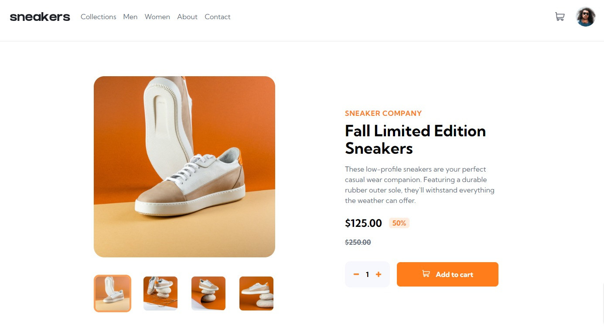

# Frontend Mentor - E-commerce product page solution

This is a solution to the [E-commerce product page challenge on Frontend Mentor](https://www.frontendmentor.io/challenges/ecommerce-product-page-UPsZ9MJp6). Frontend Mentor challenges help you improve your coding skills by building realistic projects.

## Table of contents

- [Overview](#overview)
  - [The challenge](#the-challenge)
  - [Screenshot](#screenshot)
  - [Links](#links)
- [My process](#my-process)
  - [Built with](#built-with)
  - [What I learned](#what-i-learned)
  - [Useful resources](#useful-resources)
- [Author](#author)

## Overview

### The challenge

Users should be able to:

- View the optimal layout for the site depending on their device's screen size
- See hover states for all interactive elements on the page
- Open a lightbox gallery by clicking on the large product image
- Switch the large product image by clicking on the small thumbnail images
- Add items to the cart
- View the cart and remove items from it

### Screenshot

### Links

- Solution URL: [Solution URL here](https://github.com/nevredimiy/ecommerce-product-page-main/tree/mybranch)
- Live Site URL: [Live site URL here](https://ecommercy-product-page-main.onrender.com)

## My process

### Built with

- Semantic HTML5 markup
- CSS custom properties
- Flexbox
- CSS Grid
- Mobile-first workflow
- [React](https://reactjs.org/) - JS library
- [Tailwincss](https://tailwindcss.com/) - For styles

### What I learned

Repeated context and useReducer hooks. Learned new hooks react-detect-click-outside. this hook helped me solve the problem of closing the modal window when clicking outside the component.

### Useful resources

- [React detect click outside](https://www.npmjs.com/package/react-detect-click-outside) 

## Author
- Website - [Artem](https://writecode6.wordpress.com/%d0%be%d0%b1%d0%be-%d0%bc%d0%bd%d0%b5/)
- Frontend Mentor - [@nevredimiy](https://www.frontendmentor.io/profile/nevredimiy)
- Youtube - [@write-code](https://studio.youtube.com/channel/UCnmIQSMt8ayFgE2deKtAaKQ)

